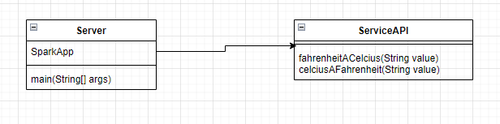

# Celcius  A Fahrenheit

Este proyecto esta desarrollado y construido usando el framework Spark,permite consumir una api mediante web en la que se podra realizar operaciones para pasar grados Celcius a Farenheit o grados Farenheit a Celcius




### ¿Como Ejecutarlo?

Se debe contar con el proyecto clonado y compilado debidamente usando maven, posteriormente ejecutar el siguiente comando

* Maquinas con distribuciones de linux:
> java -cp target/classes:target/dependency/* co.edu.escuelaing.sparkapp.Server
* Maquina con windows
> java -cp target/classes;target/dependency/* co.edu.escuelaing.sparkapp.Server

### Prerrequisitos
Eston son los requisitos que software que tienen que estar instalados previamente:

```
Maven
```
```
Git
```
```
Fue ejecutado con version java 1.8
```
## Construcción 
* [Maven](https://maven.apache.org/) - Dependencias de maven


## Autores

Brayan Alexis Jiménez Moya


## Licencia

En este proyecto se usó la licencia GNU - se puede ver [LICENSE](LICENSE.txt) para más detalles.
